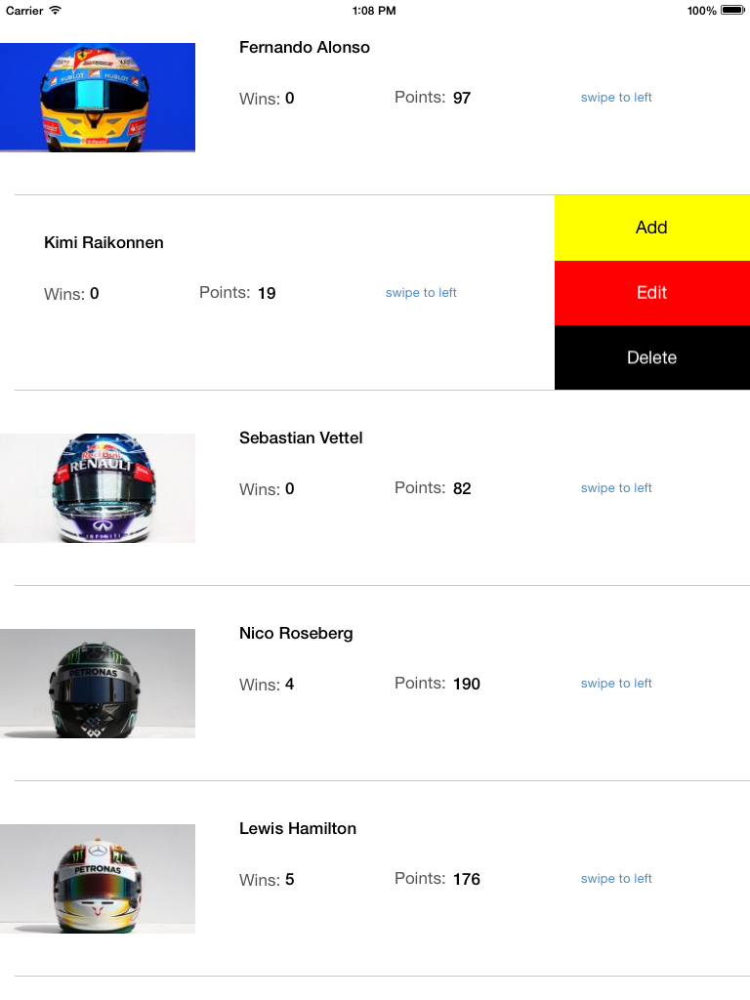

GSSwipeableCell V 0.1
================================

A UITableViewCell Subclass, designed for iPad.

Easily add utility buttons like the mail app but stacked vertically.
Customise each button with different text color and background color.

Installation
==============

Just drag GSSwipeableCell folder to your project.
When creating a custom table cell subclass GSSwipeableCell instead of UITableViewCell.
In table view's data source (cellForRowAtIndexPath) initialise buttons as needed for cell.

Implement GSSwipeableCellDelegate to get notified when any button got clicked.

TODO
==============

- Contraints have to be set up
- Drag back if not swiped to full button's width