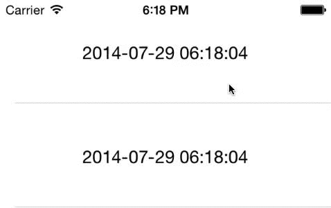

GSSwipeableCell V 0.1
================================

A UITableViewCell Subclass, designed for iPad.

Easily add utility buttons like the mail app but stacked vertically.
Customise each button with different text color and background color.



Installation
==============

Just drag GSSwipeableCell folder to your project.
When creating a custom table cell subclass GSSwipeableCell instead of UITableViewCell.
In table view's data source (cellForRowAtIndexPath) initialise buttons as needed for cell.

Implement GSSwipeableCellDelegate to get notified when any button got clicked.

For example, consider a custom table view cell SampleTableViewCell, so to add vertical buttons :

```
-(UITableViewCell *)tableView:(UITableView *)tableView cellForRowAtIndexPath:(NSIndexPath *)indexPath
{
SampleTableViewCell *cell = (SampleTableViewCell*)[tableView dequeueReusableCellWithIdentifier:@"cell"];
[cell addUtilityButtons:[self utilButtons]]; // Get Button Descriptions
[cell setGSSwipeCelldelegate:self];
cell.tag = indexPath.row;
}

// Returns an array of dictionaries of Button Descriptions. 
- (NSArray*)utilButtons
{
NSDictionary *addButton = @{ButtonTitle: @"Add",
ButtonColor: [UIColor yellowColor],
ButtonTitleColor: [UIColor blackColor]};
NSDictionary *editButton = @{ButtonTitle: @"Edit",
ButtonColor: [UIColor redColor]};
NSDictionary *deleteButton = @{ButtonTitle: @"Delete",
ButtonColor: [UIColor blackColor]};
return @[addButton, editButton, deleteButton];
}
```

So thats it, when you swipe you will be able to see the buttons beneath the cell's content view.

To get to know which button got clicked implement `GSSwipeCellDelegate` protocol in your table view controller. So for example : 

```
/**
* Button Identifier is an integer(0 to n) indicating the position of button in the vertical stack
*/
-(void)didClickOnButtonWithIdentifier:(NSInteger)buttonIdentifier onCell:(id)cell
{
SampleTableViewCell *tableViewCell = (SampleTableViewCell*)cell;
switch (buttonIdentifier) {
case AddButton: // NS_ENUM defined in view controller
NSLog(@"Add Button Got Clicked on Cell : %d", tableViewCell.tag);
break;
case EditButton:
NSLog(@"Edit Button Got Clicked on Cell : %d", tableViewCell.tag);
break;
case DeleteButton:
NSLog(@"Delete Button Got Clicked on Cell : %d", tableViewCell.tag);
break;
}
}
```

TODO
==============

- Contraints have to be set up
- Drag back if not swiped to full button's width